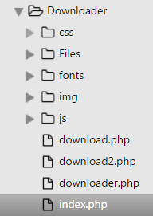
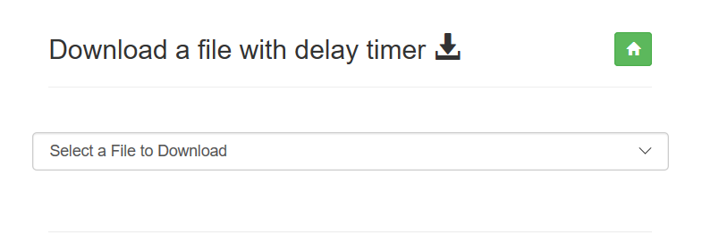
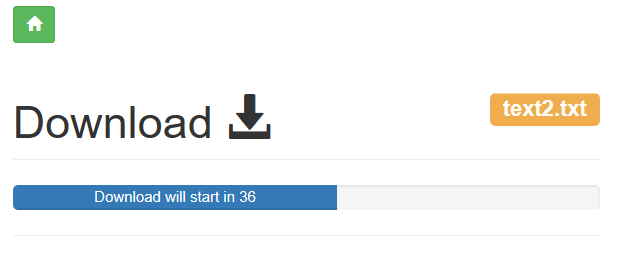
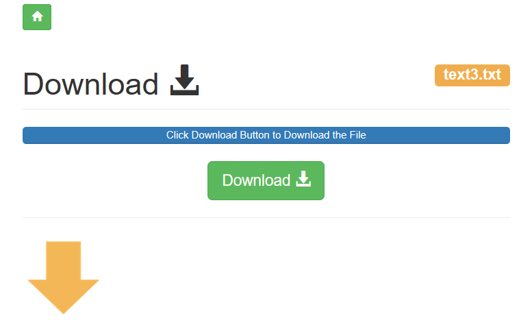

 File Downloader from an Inbox selection
=======================================

Background
----------

This is a delayed File-Downloader which can download virtually any file directly
to your PC or Mobile. A selector box is populated with files from a folder. The
Selected file from the Selector box is downloaded.

Project Scope
-------------

-   Must not show the download button immediately to prevent non-human
    downloading.

-   Must keep the user knowledgeable as to what is happening by adding a
    count-down timer linked to a progress bar.

-   Must flow automatically.

-   Must immediately download the file that was selected on the click of the
    button that became visible after completion of the progress bar.

Coding Difficulty
-----------------

**Medium**. Good knowledge of **Javascript/Ajax** and **PHP** required would
help.

Libraries
---------

**Bootstrap 3 Framework –** download here or visit the website at
**http://getbootstrap.com**.

**PHP 5.6 + - download** [here](http://php.net/) **.**

**JQuery** – download from [here](http://jquery.com/) **or visit the website**
<http://jquery.com>.

**Javascript.**

Structure
---------

Code
----

Create index.php.

**Index.php**

\<code\>

**\<!DOCTYPE html\>**

**\<html lang="en"\>**

**\<head\>**

**\<meta charset="utf-8"\>**

**\<meta http-equiv="X-UA-Compatible" content="IE=edge"\>**

**\<meta name="viewport" content="width=device-width, initial-scale=1"\>**

**\<title\>Download File\</title\>**

**\<meta name="description" content="How to download a file with PHP "\>**

**\<link href="css/bootstrap.min.css" rel="stylesheet"\>**

**\</head\>**

**\
**

**\
**

**\<br\>**

**\<h3\>Download a file with delay timer \ \</span\> \\<a class="btn btn-sm btn-success" href="index.php"\>\\</span\>\</a\>\</span\>\</h3\>**

**\<hr\>**

**\<form class="form-horizontal" form method="POST" action="download.php"\>**

**\
**

**\<label for="selectid"\>\</label\>**

**\<!--Add onchange event --\>**

**\<select class="form-control" required="required" name = "selectid" onchange =
"this.form.submit();"\>**

**\<option\>Select a File to Download\</option\>**

Here we populate the Selector which has the ‘selectid ‘as the id. The PHP below
populates the selector by reclusively by applying the’ foreach ‘ call . Each
file is a \$filename for the Folder called ‘Files’.

**\<?php**

**// Get the filenames that are in the Directory and parse them into the drop
down list.**

**foreach(glob(dirname(\_\_FILE\_\_) . '/Files/\*') as \$filename){**

**\$filename = basename(\$filename);**

**echo "\<option value='" . \$filename . "'\>".\$filename."\</option\>";**

**}**

**?\>**

**\</select\>**

**\</div\>**

**\<br\>**

**\<hr\>**

**\</form\>**

**\</div\>**

**\</div\>**

**\</div\>**

**\</html\>**

**\</code\>**

When the selected file is clicked , it will fire the ‘**onchange =
"this.form.submit()’ in the ‘\<Select\>’.**

This will post the ‘indexid’ which holds the filename to the file ‘download.php.

Create download.php.

This file will catch the posted filename and then immediately start the
Javascript timer which will control the bootstrap progress-bar with a few label
informative auto updates.

**Download.php**

The session is started because we will need to move the filename to the final
download file when we click on the button to download the file.

The sent filename **‘selectid’** is received if the **\$\_POST** is not empty.
We capture it into the session **‘\$\_SESSION[‘SelectFile”]’** for later use.

**\<code\>**

**\<?php**

**session\_start();**

**\$SelectFile = "";**

**if ( !empty(\$\_POST)) {**

**//Reset Value**

**\$SelectFile = "";**

**\$SelectFile = \$\_POST['selectid'];**

**\$\_SESSION['SelectFile'] = \$\_POST['selectid'];**

**}**

**?\>**

**\<!DOCTYPE html\>**

**\<html lang="en"\>**

**\<head\>**

**\<meta charset="utf-8"\>**

**\<meta http-equiv="X-UA-Compatible" content="IE=edge"\>**

**\<meta name="viewport" content="width=device-width, initial-scale=1"\>**

**\<title\>Download File - Downloads files from Web Server\</title\>**

**\<meta name="description" content="Bayesean Blog Downloading a File"\>**

**\<link href="css/bootstrap.min.css" rel="stylesheet"\>**

**\</head\>**

**\
\</div\>**

**\</form\>**

**\</div\>**

**\<script type = "text/javascript"\>**

**\$("\#myId").removeClass("hidden");**

**\$("\#myimg").removeClass("hidden");**

**\</Script\>**

**\
**

**\
**

**\
**

**\<!--\
--\>**

**\<br\>**

**\<p\>\<a class="btn btn-sm btn-success" href="index.php"\>\\</span\>\</a\>\</p\>**

**\<h1 class="page-header"\> Download \\</span\>\<small\> \\<?php echo " ".\$SelectFile."
" ?\>**

**\</span\>\</small\>\</h1\>**

**\
**

Here we add the progress bar id “progressbar”. This will be called by the
javascript countdown timer.

**\
**

**\</div\>**

**\</div\>**

As we only want the download image and download button to show after the full
countdown has been completed , the button and image ares wrapped in a hidden
class with each one having its own id . This will be used by the Javascript
countdowntimer to cancel the hidden class.

**\
**

**\
**

**\<p\>\<a class="btn btn-lg btn-success" href="download2.php"\> Download \\</span\>\</a\>\</p\>**

**\</div\>**

**\</div\>**

**\<hr\>**

**\
**

**\<p\>\\<p\>**

**\</div\>**

**\</div\>**

**\</div\> \<!-- /bootstrap sizing --\>**

**\</div\> \<!-- /container --\>**

**\<!-- start the progressbar;--\>**

The Javascript countdown timer immediately starts and sets the width of the
**progressbar** . The counter has variables to calculate the progress of the
timer.

**Setinterval()** calls **function progressbar()** every **‘100 milliseconds’**
set by the **var ‘stepdelay’** until completed. This is set to run for the **var
‘dcount’** times. **var ’width’** is set to 0 because we require the
**progressbar** to finish at 0.

The **function progressbar()** determines when the image download and button
must become visible.

Using the **document.getElementById** is used to change the different messages
in the progressbar.

**\<script type = "text/javascript"\>**

**var w = document.getElementById("progress-bar").style.width;**

**var res = w.substr(0,(w.length)-1);**

**if ( res \> 50) {}**

**else{**

**var varinfo = " Download will start in ";**

**var varinfo2 = " Click Download Button to Download the File";**

**// set the time before next step in X 0.1 second**

**var stepdelay = 100;**

**//set the increments to step by**

**var stepby = 1;**

**var stepdown = 1;**

**var width = 0;**

**var dcount = 150;**

**var Id = setInterval(ProgressSteps,stepdelay);**

**function ProgressSteps(){**

**if (width \> 99){**

**\$("\#myId").removeClass("hidden");**

**\$("\#myimg").removeClass("hidden");**

**document.getElementById("progress-bar").innerHTML =varinfo2;**

**return;**

**window.close();**

**clearinterval(Id);**

**}else{**

**width = width + stepby;**

**dcount = 100 - width;**

**document.getElementById("progress-bar").style.width=width+"%";**

**document.getElementById("progress-bar").innerHTML =varinfo + " "+ dcount;**

**}**

**}**

**}**

**\</script\>**

**\<script src="js/jquery.js"\>\</script\>**

**\<script src="js/bootstrap.min.js"\>\</script\>**

**\</div\>**

**\</body\>**

**\</code\>**

**Finally on click of the download button , the browser is redirected to
Download2.php.**

**Download2.php**

**\<code\>**

The selected file that was in the **Global Session**, is now used to create the
**‘\$filepath’** to be downloaded.

We get the server to **sleep for 1 second** just to ensure that the server has
the library that was **included\_ once** is now fully loaded.

We call **‘download(\$filepath)’** this will call the library in the
**downloader.php** file and the file is immediately downloaded to the file
directory that your browser points to.

**\<?php**

**session\_start();**

**\$Directory = 'Files/';**

**if(!isset(\$\_SESSION['SelectFile'])){**

**header('Location: index.php');**

**}**

**include\_once 'downloader.php';**

**\_SESSION['SelectFile'] ;**

**\$filepath = \$Directory."". \$\_SESSION['SelectFile'] ;**

**sleep(1);**

**download(\$filepath);**

**\$filepath = '';**

**exit;**

**?\>**

**\</code\>**

The final code is the calling of the **downloader.php** file that forces the
download of the files.

**\<?php**

**function download(\$file\_name)**

**{**

**if(is\_file(\$file\_name)) {**

**if(ini\_get('zlib.output\_compression')) {
ini\_set('zlib.output\_compression', 'Off'); }**

**// get the file mime type using the file extension**

**switch(strtolower(substr(strrchr(\$file\_name, '.'), 1))) {**

**case '7z' : \$mime = 'application/x-7z-compressed'; break;**

The code has too many mime optons to include here…….

**default: \$mime = 'application/force-download';**

**}**

**header('Pragma: public');**

**header('Expires: 0'); //0 is no cache**

**header('Cache-Control: must-revalidate, post-check=0, pre-check=0');**

**header('Last-Modified: '.gmdate ('D, d M Y H:i:s', filemtime (\$file\_name)).'
GMT');**

**header('Cache-Control: private',false);**

**header('Content-Type: '.\$mime);**

**header('Content-Disposition: attachment;
filename="'.basename(\$file\_name).'"');**

**header('Content-Transfer-Encoding: binary');**

**header('Content-Length: '.filesize(\$file\_name)); // provide the full file
size**

**header('Connection: close');**

**readfile(\$file\_name); //Standard push the file to browser**

**exit();**

**}**

**}**

**?\>**

**\</code\>**

**Author**

**Greg Bayes** - [Bayesean Blog](https://www.bayeseanblog.com/).

https://www.bayeseanblog.com.

**License**

This project is licensed under the MIT license agreement.

Permission is hereby granted, free of charge, to any person obtaining a copy of
this software and associated documentation files (the "Software"), to deal in
the Software without restriction, including without limitation the rights to
use, copy, modify, merge, publish, distribute, sublicense, and/or sell copies of
the Software, and to permit persons to whom the Software is furnished to do so,
subject to the following conditions: The above copyright notice and this
permission notice shall be included in all copies or substantial portions of the
Software.

THE SOFTWARE IS PROVIDED "AS IS", WITHOUT WARRANTY OF ANY KIND, EXPRESS OR
IMPLIED, INCLUDING BUT NOT LIMITED TO THE WARRANTIES OF MERCHANTABILITY, FITNESS
FOR A PARTICULAR PURPOSE AND NONINFRINGEMENT. IN NO EVENT SHALL THE AUTHORS OR
COPYRIGHT HOLDERS BE LIABLE FOR ANY CLAIM, DAMAGES OR OTHER LIABILITY, WHETHER
IN AN ACTION OF CONTRACT, TORT OR OTHERWISE, ARISING FROM, OUT OF OR IN
CONNECTION WITH THE SOFTWARE OR THE USE OR OTHER DEALINGS IN THE SOFTWARE.
