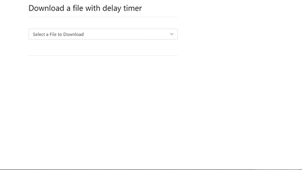

Delayed Countdown PHP & JavaScript Downloader with Bootstrap 4
==============================================================

View the Bayesean Blog
----------------------

<https://bayeseanblog.com/blog/php-file-downloader-from-a-inbox-selection/4>

This is an update of the original blog updated from bootstrap 3 to use bootstrap
4 .The viewer has been removed and replaced with the above gif.

Project Scope
-------------

-   Must not show the download button immediately to prevent non-human
    downloading.

-   Must keep the user knowledgeable as to what is happening by adding a
    count-down timer linked to a progress bar.

-   Must flow automatically.

-   Must immediately download the file that was selected on the click of the
    button that became visible after completion of the progress bar.

Coding Difficulty
-----------------

**Medium**. Good knowledge of **Javascript/Ajax** and **PHP** required would
help.

Libraries
---------

**Bootstrap 4 Framework.**

**PHP 5.6.**

**Downloader.php** - A PHP Library (A free to use file download library created
by Jack Mason )

This is included in the included Download below.

**JQuery** – download from [here](http://jquery.com/) **or visit the website**
<http://jquery.com>.

**Javascript.**

Structure
---------

**Index.php**

This file contains the visual element of a drop down box to select the file to
download.

**Download2.php**

This file contains the visual download progress bar and button to download the
file.

**Downloader1.php**

This file is called by the download button and processes the file to download.

**Downloader.php**

This holds all the mime information and allows any type of file to be
downloaded.

Code
----

Visit the Bayesean Blog to gain insight on the functionality of the code.

License
-------

Licence is MIT.
